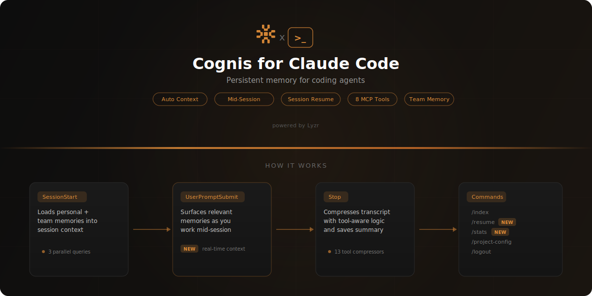
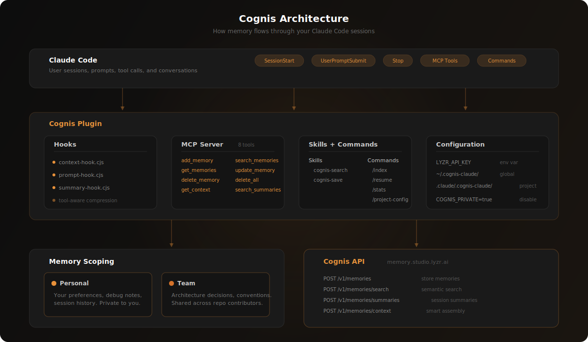

<p align="center">
  
</p>

<h3 align="center">Give Claude Code a memory that never forgets</h3>

<p align="center">
  
  
  
  
</p>

---

## Features

- **Automatic context** — Relevant memories are loaded at the start of every session, so Claude already knows what you've been working on
- **Mid-session memory** — As you work, relevant memories are surfaced automatically based on what you're asking about
- **Session capture** — When you end a session, your conversation is automatically summarized and stored with tool-aware compression
- **Session recall** — Pick up exactly where you left off with `/claude-cognis:recall`
- **Personal + team memory** — Your memories are private by default; team knowledge is shared across everyone on the same repo
- **Semantic search** — Find past decisions, patterns, and context using natural language queries
- **Codebase indexing** — Analyze and store your project's architecture so Claude understands your codebase from the first message
- **Memory stats** — See what Cognis has stored with `/claude-cognis:memory-stats`
- **Smart context assembly** — Cognis intelligently combines short-term and long-term memory to build the most relevant context

## Quick Start

**1. Get your API key** at [studio.lyzr.ai](https://studio.lyzr.ai)

**2. Install the plugin**

In Claude Code, run:

```
/plugin marketplace add Lyzr-Cognis/claude-cognis
/plugin install claude-cognis
```

**3. Set your API key**

```bash
export LYZR_API_KEY="your-api-key"
```

Or save it permanently in `~/.cognis-claude/settings.json`:

```json
{ "apiKey": "your-api-key" }
```

That's it. Cognis will automatically load memories when you start a session and save them when you stop.

## Architecture

<p align="center">
  
</p>

## How It Works

### Hooks

Cognis uses Claude Code's hook system to work automatically in the background.

| Hook | Trigger | What it does |
|------|---------|--------------|
| `SessionStart` | Every new session | Loads relevant personal and team memories into context |
| `UserPromptSubmit` | Each user message | Surfaces relevant memories mid-session based on what you're working on |
| `Stop` | Session ends | Summarizes the conversation and saves it to memory with tool-aware compression |

### Skills

Natural language triggers — just talk to Claude and the right skill activates.

| Skill | Trigger phrases | What it does |
|-------|----------------|--------------|
| `cognis-search` | "what did I work on?", "find that decision about..." | Searches your memories using semantic search |
| `cognis-save` | "remember this", "save this as project knowledge" | Saves specific information to persistent memory |

### MCP Tools

For advanced usage, Cognis exposes 8 tools via the Model Context Protocol.

| Tool | Description |
|------|-------------|
| `add_memory` | Store information in long-term memory |
| `search_memories` | Semantic search across personal and/or team memories |
| `get_memories` | List stored memories without a search query |
| `update_memory` | Update an existing memory's content or metadata |
| `delete_memory` | Delete a specific memory by ID |
| `delete_all_memories` | Clear all memories for a session (requires confirmation) |
| `get_context` | Intelligent context assembly combining short-term and long-term memory |
| `search_summaries` | Search past session summaries and key decisions |

## Commands

| Command | Description |
|---------|-------------|
| `/claude-cognis:index` | Analyze and index the current codebase |
| `/claude-cognis:recall` | Recall last session context to pick up where you left off |
| `/claude-cognis:memory-stats` | Show memory statistics and recent session history |
| `/claude-cognis:project-config` | Configure per-project settings |
| `/claude-cognis:logout` | Remove stored API credentials |

## Configuration

### Global Settings

Stored in `~/.cognis-claude/settings.json`:

| Setting | Type | Default | Description |
|---------|------|---------|-------------|
| `apiKey` | `string` | — | Your Lyzr API key |
| `maxMemoryItems` | `number` | `5` | Maximum memories loaded into session context |
| `debug` | `boolean` | `false` | Enable debug logging |
| `signalExtraction` | `boolean` | `false` | Only capture important conversation turns |
| `signalKeywords` | `string[]` | `["remember", "architecture", ...]` | Keywords that trigger signal capture (17 built-in) |
| `signalTurnsBefore` | `number` | `3` | Context turns to include before a signal |

### Per-Project Config

Override settings per project in `.claude/.cognis-claude/config.json`. Run `/claude-cognis:project-config` or create it manually:

| Setting | Type | Default | Description |
|---------|------|---------|-------------|
| `apiKey` | `string` | — | Project-specific API key |
| `ownerId` | `string` | System username | Override the owner identifier |
| `agentId` | `string` | Auto-generated | Override the personal agent ID |
| `repoAgentId` | `string` | `repo_<name>` | Override the team agent ID |

## Memory Scoping

Cognis separates memory into two scopes:

- **Personal** — Tied to your identity and the current project. Only you see these memories. Great for your preferences, debugging notes, and session history.
- **Team** — Tied to the repository name. Shared across everyone using the plugin on the same repo. Ideal for architectural decisions, project conventions, and shared knowledge.

When you search memories, both scopes are queried by default so you get the full picture.

## Environment Variables

| Variable | Default | Description |
|----------|---------|-------------|
| `LYZR_API_KEY` | — | Lyzr API key (required) |
| `COGNIS_API_URL` | `https://memory.studio.lyzr.ai` | Custom API base URL |
| `COGNIS_OWNER_ID` | System username | Override owner identifier |
| `COGNIS_PRIVATE` | `false` | Disable cross-session memories for this terminal |
| `COGNIS_ISOLATE_WORKTREES` | `false` | Treat git worktrees as separate projects |

## Privacy & Data

Cognis sends data to the Cognis API (`memory.studio.lyzr.ai`) to store and retrieve memories. Here's what you should know:

- **No data is sent without an API key.** If `LYZR_API_KEY` is not set, all hooks exit immediately and no network requests are made.
- **SessionStart hook** sends search queries to retrieve your previously stored memories. No conversation data is sent during this step.
- **UserPromptSubmit hook** sends a short search query based on your prompt to find relevant memories. Only the first 150 characters of your prompt are used. Skips trivial inputs like "yes", "ok", or slash commands.
- **Stop hook** sends a compressed summary of your session transcript so it can be recalled in future sessions. Tool outputs are intelligently compressed (e.g., file edits become one-line summaries). Raw transcripts are not stored — only summaries.
- **All data is scoped** to your owner ID and agent ID. Personal memories are private to you; team memories are shared by repository name.
- **You control what's saved.** Use `signalExtraction: true` in your project config to only capture turns containing specific keywords, rather than the full session. Use `COGNIS_PRIVATE=true` to disable memory entirely for a terminal session.
- **You can delete your data** at any time using the `delete_memory` or `delete_all_memories` MCP tools.

## Development

```bash
npm install        # Install dependencies
npm run build      # Bundle src/ → scripts/
npm run lint       # Check with Biome
npm run lint:fix   # Auto-fix lint issues
npm run format     # Format with Biome
npm run clean      # Remove built files
```

Built with [esbuild](https://esbuild.github.io) and [Biome](https://biomejs.dev).

## License

[MIT](LICENSE)

<p align="center">
  <br />
  Built by <a href="https://lyzr.ai">Lyzr</a>
</p>
